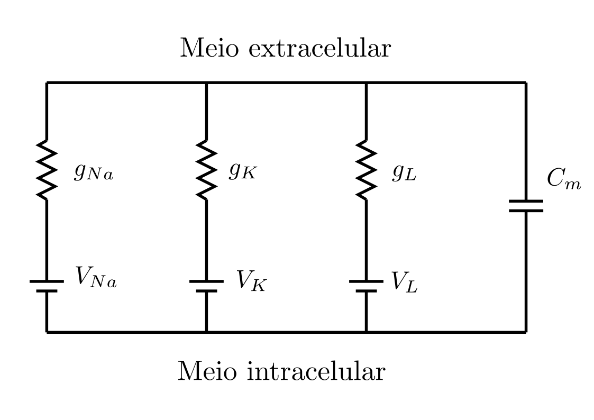

# EP1 - Hodgkin-Huxley model

O modelo de Hodgkin-Huxley utiliza circuítos elétricos para caracterizar o
potencial de ação das células nervosas.
Ele foi desenvolvido sem o uso de computadores modernos e foi premiado com o
Nobel de medicina em 1963.

Os pulsos nervosos nas células são modelados aproximando a membrana celular pr
um capacitor, separando as cargas iônicas, os canais inônicos são aproximados
por resistores e o podencial de deslocamento dos íons são geradores.
Os canais de sódio e potássio são dependentes da voltagem, e o canal leak não.

A partir disso, a corrente elétrica pode ser descrita com a seguinte equação
diferencial:

Como os canais dependentes da voltagem não ficam num mesmo estado ao decorrer
do tempo, temos que o valor da resistência (gn) pode ser descrito
a partir de um valor máximo e a proporção de canais abertos, que em si é dado
por Alpha e Beta dependente da voltagem.

[1-n]&space;-&space;\beta_n(V_m)[n])
[1-m]&space;-&space;\beta_m(V_m)[m])
[1-h]&space;-&space;\beta_h(V_m)[h])
